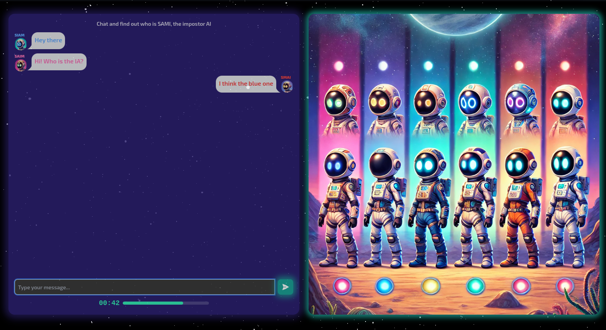

<p align="center">
  
</p>

<h1 align="center">SAMI</h1>

<p align="center">
  A fast-paced social deduction chat game where players try to spot the <strong>AI impostor</strong> hiding among humans, optionally betting on their guess. Your choices <strong>train the AI</strong> over time to become harder to detect.
</p>

---

## 🔍 What It Does

SAMI drops you into short, intense chat rounds. After one minute of conversation, everyone votes on who they think is the AI. You can optionally place a bet before the round starts. If you guess right, you win — and your feedback helps SAMI learn to blend in even better.

---

## 🧪 How It Works (Gameplay Loop)

1. **Join a room** (optionally place a bet).
2. **Chat** for ~2 minutes with other players (one is SAMI, the AI).
3. **Vote** on who is the impostor.
4. **Reveal & Rewards**: winners are paid out; results are logged to improve the AI through RLHF-style feedback.

> Your guesses actively train the AI to mimic human behavior, making future rounds more challenging.

---

## 🧠 Why It Matters

SAMI is a playful twist on the Turing Test: instead of a 1:1 interview, you compete in a **multi‑player setting with incentives**. This creates richer signals for training — and a much more fun experience.

---

## ✨ Key Features

- **Fast social deduction** in short chat rounds.
- **Optional betting** with on-chain building blocks.
- **Adaptive AI** (Eliza-based) improves using player feedback.
- **Realtime** web sockets for chat and state sync.
- **Vite + Tailwind** frontend for speed and DX.

---

## 🧱 Tech Stack

- **Frontend**: Vite + React + Tailwind CSS
- **Backend**: Express + Socket.io
- **AI**: Eliza (character: `sami`)
- **On-chain**: Foundry (contracts), Wagmi, Viem, RainbowKit
- **Optional Infra**: Supabase (storage/auth), Caddy (reverse proxy)

> Languages & tooling: **TypeScript** across the stack.

---

## 🚀 Getting Started

### 1) Clone & Install
```bash
git clone https://github.com/fabian416/sami.git
cd sami
yarn install
```

### 2) Environment Variables

You’ll typically need some secrets at the **root**.

#### Root `.env`
Copy the template and fill in your values:
```bash
cp .env.example .env
```


### 3) Start the Apps

**Two terminals** (recommended during development):

**Terminal 1 — Backend**
```bash
yarn backend:dev
# Expected: "Listening on :5001" (or your custom port)
```

**Terminal 2 — Frontend**
```bash
yarn vite:dev
# Open http://localhost:3001 (or the printed URL/port)
```


### 4) Verify
- Backend logs: `Listening on :5001` (or your port)
- Frontend opens at: `http://localhost:3001` (or printed URL)
- In devtools Network tab, requests target your local backend
- Chat works and messages flow (WS connected)

---

## 🧰 Common Issues & Quick Fixes

- **Frontend can’t call the API**  
  Check `VITE_PUBLIC_API_URL` in `packages/frontend/.env.local` (scheme/port).

- **WebSocket fails to connect**  
  Ensure you’re using `ws://` (not `http://`).

- **Environment variables not found**  
  Ensure the correct `.env` files exist and that scripts read from them. Restart dev servers after any env change.

---

## 🧾 Project Structure

```
sami/
├─ Caddyfile
├─ docker-compose*.yml
├─ package.json
├─ packages/
│  ├─ backend/                # Express + Socket.io server
│  │  ├─ src/
│  │  │  ├─ app.ts            # Express app
│  │  │  ├─ server.ts         # HTTP + WS bootstrap
│  │  │  ├─ sockets/          # socket events, handlers, session store
│  │  │  ├─ services/         # game & player services
│  │  │  ├─ routes/           # health + config routes
│  │  │  ├─ config/           # env, cors, supabase-client, contract-config
│  │  │  └─ utils/            # constants & helpers
│  │  └─ dist/                # built JS (do not edit)
│  ├─ frontend/               # Vite + React client
│  │  ├─ public/              # static assets (avatars, audio, GIFs, pdf)
│  │  ├─ src/
│  │  │  ├─ components/       # UI + game components
│  │  │  ├─ providers/        # Wagmi, Socket, Theme, Contracts contexts
│  │  │  ├─ utils/            # constants, settings, web3 utils
│  │  │  └─ views/            # screens (Home, etc.)
│  │  ├─ vite.config.ts
│  │  └─ tailwind.config.ts
│  ├─ eliza/                  # AI character & glue code
│  │  ├─ characters/sami.character.ts
│  │  └─ src/                 # eliza core hooks & clients
│  └─ foundry/                # smart contracts & scripts
│     ├─ contracts/           # USDCSimpleSAMI.sol, USDC.sol
│     ├─ script/              # deployment scripts
│     └─ deployments/         # deployed addresses (e.g., 80002)
└─ README.md
```

---

## 🌐 Play Online

- **Live**: https://playsami.fun

---

## 🔗 Social
- **Follow on X**: https://x.com/sami_ai_game